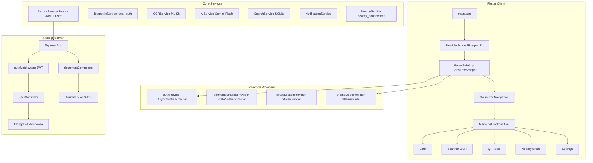
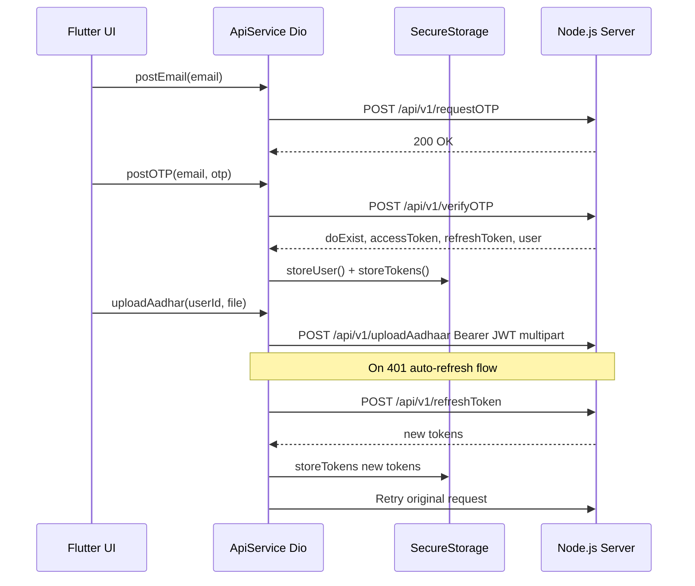
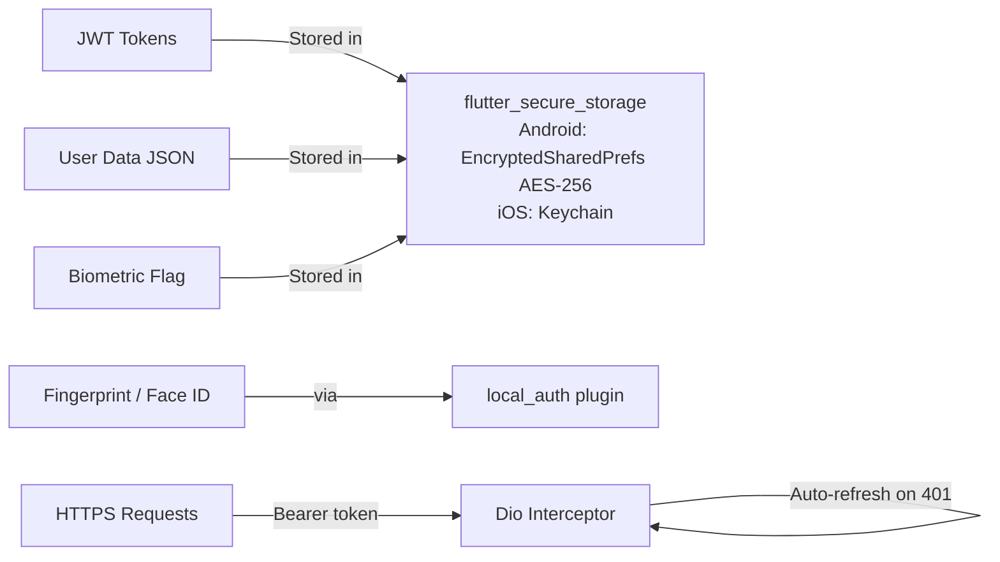
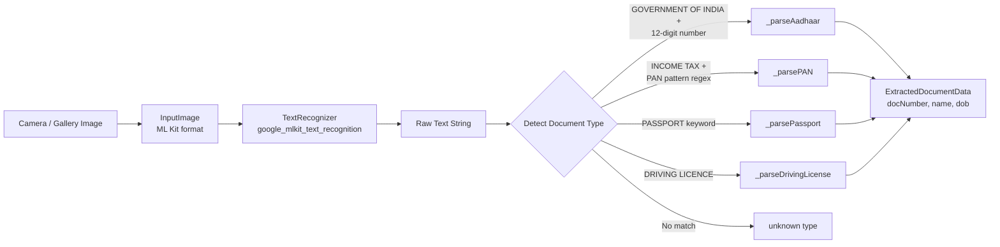

# PaperSafe v2.0 – Complete Architecture & Interview Guide

> **App Summary**: PaperSafe is an AI-powered secure digital document wallet for Indian documents. Store Aadhaar, PAN, marksheets, and tickets securely. Built with Flutter + Node.js/Express + MongoDB + Cloudinary.

---

## 1. High-Level System Architecture



---

## 2. Flutter Project Structure

```
client/lib/
├── main.dart                        App entry, ProviderScope, ScreenUtil init
├── api_services/
│   └── api_services.dart            Dio HTTP client + JWT interceptor + all API calls
├── constants/
│   ├── colorManager.dart            Legacy colors
│   └── strings_values.dart          App string constants
├── core/
│   ├── providers/
│   │   ├── auth_provider.dart       AuthNotifier (AsyncNotifier)
│   │   └── biometric_provider.dart  BiometricNotifier + isAppLockedProvider
│   ├── router/
│   │   └── app_router.dart          GoRouter config + MainShell (bottom nav)
│   ├── services/
│   │   ├── ai_service.dart          Gemini 1.5 Flash wrapper
│   │   ├── biometric_service.dart   local_auth wrapper
│   │   ├── expiry_checker_service.dart  Schedule doc expiry notifications
│   │   ├── nearby_service.dart      nearby_connections wrapper
│   │   ├── notification_service.dart  flutter_local_notifications
│   │   ├── ocr_service.dart         ML Kit text recognition + regex parsing
│   │   ├── places_service.dart      Google Places API via Dio
│   │   ├── search_service.dart      SQLite full-text search
│   │   └── secure_storage_service.dart  flutter_secure_storage (JWT, user)
│   ├── theme/
│   │   ├── app_colors.dart          Centralized color palette
│   │   ├── app_theme.dart           Material 3 ThemeData (dark + light)
│   │   └── theme_provider.dart      themeModeProvider StateProvider
│   └── widgets/                     Shared core widgets
├── models/
│   ├── user.dart                    User data class + fromJson/toJson
│   ├── user_manager.dart            Legacy singleton
│   ├── documents_manager.dart       Singleton: download/cache/share documents
│   ├── image_model.dart             ImageModel(title, image: Uint8List)
│   ├── extrac_images.dart           ZIP extraction for movie tickets
│   ├── app_preferences.dart         SharedPreferences wrapper
│   ├── aadhar_frame.dart            Aadhaar card overlay data
│   └── pan_frame.dart               PAN card overlay data
├── views/                           27 screen files
└── Widgets/                         Reusable UI components
    ├── adding_frame.dart
    ├── country_picker.dart
    ├── document_button.dart
    ├── document_card.dart
    ├── document_selector.dart
    ├── endpoint_card.dart
    └── share_button.dart
```

---

## 3. Screen Inventory (27 Views)

| Screen | File | Purpose |
|--------|------|---------|
| Login/Signup | `login_signup.dart` | Email entry for OTP auth |
| OTP Verification | `mobile_otp.dart` | 6-digit OTP input with countdown |
| Tell More | `tell_more.dart` | New user onboarding (name, DOB, gender) |
| Home/Vault | `your_documents.dart` | Main document grid (50KB - biggest file) |
| Categories | `categories.dart` | Grouped document categories |
| Category Docs | `category_documents_page.dart` | Docs in a specific category |
| Add Document | `add_document.dart` | Single document upload flow |
| Add Documents | `add_documents.dart` | Batch add flow |
| View Documents | `view_documents.dart` | Document viewer |
| PDF Viewer | `pdf_viewer_page.dart` | Syncfusion PDF viewer |
| Scanner | `scanner_page.dart` | OCR document scanner (31KB) |
| QR Scanner | `qr_scanner_page.dart` | QR/barcode reader (23KB) |
| QR Generator | `qr_generator_page.dart` | Generate document QR codes |
| Nearby Sharing | `nearby_sharing_page.dart` | P2P file transfer (22KB) |
| AI Assistant | `ai_assistant_page.dart` | Gemini AI chat |
| Maps | `maps_page.dart` | Nearby offices (passport, RTO, banks) |
| Search | `search_page.dart` | SQLite full-text search (15KB) |
| Settings | `settings.dart` | App settings (28KB) |
| Profile Details | `profile_details_page.dart` | Edit user profile (27KB) |
| Favourites | `favourites.dart` | Starred documents |
| Trash | `trash_screen.dart` | Soft-deleted documents |
| Activity Timeline | `activity_timeline_page.dart` | Document access history |
| Dashboard Analytics | `dashboard_analytics_widget.dart` | Storage + category stats |
| Biometric Lock | `biometric_lock_screen.dart` | Fingerprint/Face unlock |
| Delete Documents | `delete_documents.dart` | Confirm deletion flow |
| Terms & Conditions | `terms_n_conditions.dart` | Legal page |
| Homepage | `homepage.dart` | Legacy home wrapper |

---

## 4. Navigation Architecture (GoRouter)

```mermaid
flowchart TD
    Start([App Launch]) --> Auth{Is Logged In?}
    Auth -->|No| Login[/login LoginPage]
    Auth -->|Yes| Bio{Biometric Enabled + Locked?}
    Bio -->|Yes| BiometricLock[/biometric-lock]
    Bio -->|No| Shell

    Login --> OTP["/otp/:email MobileOtpPage"]
    OTP -->|New User| TellMore["/tell-more/:email"]
    OTP -->|Existing User| Shell

    subgraph Shell ["ShellRoute - MainShell with Bottom Nav"]
        Home["/ YourDocuments"]
        Scanner["/scanner ScannerPage"]
        QRScanner["/qr-scanner QRScannerPage"]
        NearbyShare["/nearby-share"]
        Settings["/settings SettingsPage"]
        Categories["/categories"]
        Search["/search"]
    end

    Shell --> FullScreen["Full-Screen Routes no bottom nav"]
    FullScreen --> ProfileDetails["/profile-details"]
    FullScreen --> AIChat["/ai-chat"]
    FullScreen --> QRGenerator["/qr-generator"]
    FullScreen --> Trash["/trash"]
    FullScreen --> Timeline["/activity-timeline"]
    FullScreen --> Maps["/maps"]
```

### Route Guards in redirect callback
```dart
redirect: (BuildContext context, GoRouterState state) {
  // 1. Not logged in → /login
  if (!isLoggedIn && !isOnAuthRoute) return AppRoutes.login;
  // 2. Logged in but on /login → go home
  if (isLoggedIn && state.matchedLocation == AppRoutes.login) return AppRoutes.home;
  // 3. Biometric enabled + app locked → /biometric-lock
  if (isLoggedIn && isBiometricEnabled && isAppLocked &&
      state.matchedLocation != AppRoutes.biometricLock) return AppRoutes.biometricLock;
  return null; // No redirect
}
```

### Auto-lock on minimize (WidgetsBindingObserver)
```dart
// In MainShell (_MainShellState)
@override
void didChangeAppLifecycleState(AppLifecycleState state) {
  if (state == AppLifecycleState.paused) {
    ref.read(isAppLockedProvider.notifier).state = true;
  }
}
```

---

## 5. State Management – Riverpod

### All Providers

| Provider | Type | Holds | Used In |
|----------|------|-------|---------|
| `authProvider` | `AsyncNotifierProvider<AuthNotifier, User?>` | Current logged-in User | Router, all screens |
| `currentUserProvider` | `Provider<User?>` | `authProvider.valueOrNull` shortcut | Any screen needing user |
| `biometricEnabledProvider` | `StateNotifierProvider<BiometricNotifier, bool>` | Biometric ON/OFF setting | Router, Settings |
| `isAppLockedProvider` | `StateProvider<bool>` | Whether app needs biometric unlock | Router, MainShell |
| `themeModeProvider` | `StateProvider<bool>` | isDark toggle | main.dart |
| `appRouterProvider` | `Provider<GoRouter>` | GoRouter instance | main.dart |
| `biometricServiceProvider` | `Provider<BiometricService>` | Service singleton | Settings, BiometricLock |

### AuthNotifier (AsyncNotifier pattern)
```dart
class AuthNotifier extends AsyncNotifier<User?> {
  @override
  Future<User?> build() async {
    // Called once on provider creation - loads persisted user
    return await SecureStorageService.retrieveUser();
  }
  
  Future<void> login({required User user, required String accessToken, 
                       required String refreshToken}) async {
    await SecureStorageService.storeUser(user);
    await SecureStorageService.storeTokens(accessToken: accessToken, refreshToken: refreshToken);
    state = AsyncData(user); // Triggers rebuild in all watchers
  }
  
  Future<void> logout() async {
    await SecureStorageService.clearAll();
    state = const AsyncData(null);
  }
}
final authProvider = AsyncNotifierProvider<AuthNotifier, User?>(AuthNotifier.new);
```

### BiometricNotifier (StateNotifier pattern)
```dart
class BiometricNotifier extends StateNotifier<bool> {
  BiometricNotifier() : super(false) { _init(); }
  
  Future<void> _init() async {
    state = await SecureStorageService.getBiometricEnabled();
  }
  
  Future<bool> toggleBiometrics(bool enabled) async {
    await SecureStorageService.setBiometricEnabled(enabled);
    state = enabled; // Triggers rebuild
    return enabled;
  }
}
```

---

## 6. API & Networking Layer

### Auth Flow Sequence


### Dio JWT Interceptor
```dart
_dio.interceptors.add(InterceptorsWrapper(
  onRequest: (options, handler) async {
    final token = await SecureStorageService.getAccessToken();
    if (token != null) options.headers['Authorization'] = 'Bearer $token';
    return handler.next(options);
  },
  onError: (DioException error, handler) async {
    if (error.response?.statusCode == 401) {
      final refreshToken = await SecureStorageService.getRefreshToken();
      if (refreshToken != null) {
        // Refresh tokens, update storage, retry original request
        final response = await Dio().post('$_baseUrl/api/v1/refreshToken',
            data: {'refreshToken': refreshToken});
        final newToken = response.data['data']['accessToken'];
        await SecureStorageService.storeTokens(accessToken: newToken, ...);
        error.requestOptions.headers['Authorization'] = 'Bearer $newToken';
        final retryResponse = await _dio.fetch(error.requestOptions);
        return handler.resolve(retryResponse);
      }
    }
    return handler.next(error);
  },
));
```

### API Endpoints

| Method | Endpoint | Auth | Purpose |
|--------|----------|------|---------|
| POST | `/api/v1/requestOTP` | No | Send OTP to email |
| POST | `/api/v1/verifyOTP` | No | Verify OTP, get JWT |
| POST | `/api/v1/register` | No | Register new user |
| POST | `/api/v1/refreshToken` | No | Refresh JWT tokens |
| PATCH | `/api/v1/updateUser/:id` | JWT | Update user profile |
| DELETE | `/api/v1/deleteUser/:id` | JWT | Delete account |
| POST | `/api/v1/uploadAadhaar` | JWT | Upload Aadhaar (multipart) |
| POST | `/api/v1/uploadPAN` | JWT | Upload PAN (multipart) |
| POST | `/api/v1/uploadXMarkSheet` | JWT | Upload 10th marksheet |
| POST | `/api/v1/uploadXIIMarkSheet` | JWT | Upload 12th marksheet |
| POST | `/api/v1/uploadMovieTicket` | JWT | Upload movie ticket |
| GET | `/api/v1/downloadAadhaar/:userId` | JWT | Download as bytes |
| GET | `/api/v1/downloadPAN/:userId` | JWT | Download as bytes |
| GET | `/api/v1/downloadMovieTicket/:userId` | JWT | Download as ZIP |
| DELETE | `/api/v1/deleteAadhaar/:userId` | JWT | Hard delete |

---

## 7. Data Models

### Flutter User Model
```dart
enum Gender { male, female, other }

class User {
  String? id;            // MongoDB _id
  int? schemaVersion;
  String firstName, lastName;
  int mobileNumber;
  String emailId;
  String? uniqueId;     // Generated: name + mobileNumber hash
  DateTime dob;
  Gender gender;

  factory User.fromJson(Map<String, dynamic> json) { ... }
}
Map<String, dynamic> toJson(User user) { ... }
```

### ImageModel
```dart
class ImageModel {
  String? title;     // "Aadhaar", "PAN", "XMarkSheet", "MovieTicket1"
  Uint8List? image;  // Raw bytes (from server download or local asset)
}
```

### DocumentManager Singleton
```dart
class DocumentManager {
  static final DocumentManager _instance = DocumentManager._internal();
  factory DocumentManager() => _instance;  // Singleton
  DocumentManager._internal();

  Map<String, Uint8List?> documents = {};  // keyed by "aadhaar","pan","xMarkSheet","xiiMarkSheet"
  Map<String, List<File>?> movieTickets = {};  // "tickets" → List<File>
  List<ImageModel?> allImages = [];
  List<ImageModel?> identityImages = [];   // Aadhaar + PAN
  List<ImageModel?> educationImages = [];  // XMarkSheet + XIIMarkSheet
}
```

### Document Types
```dart
enum documentType { Aadhaar, XMarkSheet, XIIMarkSheet, MovieTicket, PAN, TrainTicket }
```

### MongoDB Mongoose Schema (User)
```javascript
const userSchema = new mongoose.Schema({
  schemaVersion: { type: Number, default: 1 },
  firstName:     { type: String, required: true },
  lastName:      { type: String },
  mobileNumber:  { type: Number, required: true, unique: true },
  emailID:       { type: String, unique: true },
  dob:           { type: Date, required: true },
  gender:        { type: String, enum: ['Male', 'Female', 'Others'] },
  uniqueID:      { type: String, required: true, unique: true },
});
```

---

## 8. Security Architecture

### Client Security Layers


### flutter_secure_storage Keys
| Key | Value |
|-----|-------|
| `ps_user` | JSON-encoded User object |
| `ps_access_token` | JWT access token (short-lived) |
| `ps_refresh_token` | JWT refresh token (long-lived) |
| `ps_biometric_enabled` | "true" / "false" |
| `gemini_api_key` | Gemini API key |

### Server Security
- **JWT** via `jsonwebtoken` — signed on OTP verify, verified in `authMiddleware.js`
- **AES-256-CBC** — images encrypted before Cloudinary upload
- **OTP** — generated via `otp-generator`, stored in `node-cache` (in-memory, auto-expiry)
- **Email OTP** — sent via Nodemailer (Gmail SMTP)

---

## 9. OCR Service Architecture



### Regex Patterns Used
```dart
// Aadhaar: 12 digits in groups of 4
RegExp(r'\b\d{4}\s?\d{4}\s?\d{4}\b')

// PAN: ABCDE1234F format (5 letters + 4 digits + 1 letter)
RegExp(r'\b[A-Z]{5}[0-9]{4}[A-Z]{1}\b')

// Passport: A1234567 format
RegExp(r'\b[A-Z]{1}[0-9]{7}\b')

// DOB: DD/MM/YYYY
RegExp(r'\b\d{2}/\d{2}/\d{4}\b')
```

---

## 10. Server Architecture (Node.js)

```
HTTP Request
     ↓
Routes (routes/v1/*.js)       → Express Router
     ↓
authMiddleware.js             → Verifies JWT Bearer token
     ↓
Controllers (controllers/*.js) → Validates req, formats res JSON
     ↓
Services (services/*.js)      → Business logic (OTP, JWT, encrypt)
     ↓
Repositories (repository/*.js)→ Mongoose CRUD operations
     ↓
MongoDB Atlas                 → Persistent storage

Separate path for images:
Services → Cloudinary         → AES-256-CBC encrypted image storage
```

### Server Modules
| File | Role |
|------|------|
| `src/index.js` | Express setup, bodyParser, CORS, port |
| `config/serverConfig.js` | dotenv PORT |
| `config/database.js` | Mongoose connect |
| `config/cloudinary.js` | Cloudinary SDK init |
| `middlewares/authMiddleware.js` | JWT verify → `req.user` |
| `middlewares/uploadMiddleware.js` | Multer file upload config |
| `services/userService.js` | OTP send/verify, JWT generate, user CRUD |
| `utils/helper/` | `generateOTP()`, `saveOTP()`, `validateOTP()`, `uniqueIDGenerator()` |
| `utils/helper/jwtHelper.js` | `generateTokens()`, `verifyRefreshToken()` |

---

## 11. Key Flutter & Dart Concepts (Interview Ready)

### 1. ConsumerWidget vs ConsumerStatefulWidget
```dart
// ConsumerWidget = StatelessWidget + ref
class PaperSafeApp extends ConsumerWidget {
  Widget build(BuildContext context, WidgetRef ref) {
    final isDark = ref.watch(themeModeProvider);
    final router = ref.watch(appRouterProvider);
  }
}

// ConsumerStatefulWidget = StatefulWidget + ref (for lifecycle + state + providers)
class MainShell extends ConsumerStatefulWidget { ... }
class _MainShellState extends ConsumerState<MainShell> with WidgetsBindingObserver {
  int _selectedIndex = 0; // local state
  // ref.read() / ref.watch() available here
}
```

### 2. AsyncNotifier (Async initial state)
```dart
class AuthNotifier extends AsyncNotifier<User?> {
  @override
  Future<User?> build() async {
    return await SecureStorageService.retrieveUser(); // async init
  }
  
  Future<void> login({...}) async {
    state = AsyncData(user); // triggers all watchers
  }
}
final authProvider = AsyncNotifierProvider<AuthNotifier, User?>(AuthNotifier.new);
// Consuming: ref.watch(authProvider).valueOrNull
```

### 3. GoRouter ShellRoute (Persistent Bottom Nav)
```dart
ShellRoute(
  builder: (context, state, child) => MainShell(child: child), // child = current tab content
  routes: [
    GoRoute(path: '/', builder: (_, __) => const YourDocuments()),
    GoRoute(path: '/scanner', builder: (_, __) => const ScannerPage()),
    // ...
  ],
),
// Navigation: context.go('/scanner') — no push, replaces content within shell
```

### 4. Singleton Pattern
```dart
class DocumentManager {
  static final DocumentManager _instance = DocumentManager._internal();
  factory DocumentManager() => _instance; // Every DocumentManager() call returns same instance
  DocumentManager._internal(); // Private constructor prevents external instantiation
}
```

### 5. Dio Interceptor Pattern
```dart
_dio.interceptors.add(InterceptorsWrapper(
  onRequest: (options, handler) async {
    options.headers['Authorization'] = 'Bearer $token';
    handler.next(options); // Continue with modified request
  },
  onError: (error, handler) async {
    if (error.response?.statusCode == 401) {
      // Refresh token logic...
      handler.resolve(retryResponse); // Resolve with retried response
    } else {
      handler.next(error); // Propagate error
    }
  },
));
```

### 6. WidgetsBindingObserver (App Lifecycle)
```dart
class _MainShellState extends ConsumerState<MainShell> with WidgetsBindingObserver {
  @override
  void initState() {
    super.initState();
    WidgetsBinding.instance.addObserver(this); // Register
  }
  
  @override
  void didChangeAppLifecycleState(AppLifecycleState state) {
    if (state == AppLifecycleState.paused) {
      ref.read(isAppLockedProvider.notifier).state = true; // Lock on minimize
    }
  }
  
  @override
  void dispose() {
    WidgetsBinding.instance.removeObserver(this); // Always unregister!
    super.dispose();
  }
}
```

### 7. PopScope (Custom Back Navigation)
```dart
PopScope(
  canPop: false, // Intercept ALL back presses
  onPopInvokedWithResult: (didPop, result) {
    if (_navigationHistory.length > 1) {
      _navigationHistory.removeLast();
      _selectedIndex = _navigationHistory.last;
      context.go(_destinations[_selectedIndex].route); // Go to previous tab
    }
  },
  child: Scaffold(...)
)
```

### 8. flutter_secure_storage (Platform Encrypted Storage)
```dart
static const _storage = FlutterSecureStorage(
  aOptions: AndroidOptions(encryptedSharedPreferences: true), // AES-256 EncryptedSharedPreferences
  iOptions: IOSOptions(accessibility: KeychainAccessibility.first_unlock), // iOS Keychain
);
// Stores JSON, tokens, preferences — all encrypted at rest
```

### 9. Broadcast Streams (NearbyService)
```dart
final StreamController<NearbyDevice> _discoveredController = StreamController.broadcast();
// .broadcast() allows multiple listeners (unlike regular StreamController)
Stream<NearbyDevice> get discoveredEndpoints => _discoveredController.stream;

// UI listens:
StreamBuilder<NearbyDevice>(
  stream: nearbyService.discoveredEndpoints,
  builder: (context, snapshot) { ... }
)
```

### 10. SQLite with sqflite
```dart
// Initialize DB with tables
await openDatabase(path, version: 1, onCreate: (db, version) async {
  await db.execute('''
    CREATE TABLE documents_index (
      id TEXT PRIMARY KEY, title TEXT, category TEXT,
      ocrText TEXT, tags TEXT, updatedAt TEXT
    )
  ''');
});

// Full-text search
final maps = await db.query('documents_index',
  where: '(title LIKE ? OR category LIKE ? OR ocrText LIKE ?)',
  whereArgs: ['%query%', '%query%', '%query%'],
  orderBy: 'updatedAt DESC'
);
```

### 11. ScreenUtil Responsive Sizing
```dart
// Baseline: 390x844 (iPhone 14 Pro)
ScreenUtilInit(
  designSize: const Size(390, 844),
  builder: (_, __) => MaterialApp.router(...)
)
// Usage: 16.w (width-scaled), 16.h (height-scaled), 14.sp (font size-scaled)
```

### 12. local_auth Biometric
```dart
final _auth = LocalAuthentication();

// Check hardware support
final canAuth = await _auth.canCheckBiometrics || await _auth.isDeviceSupported();

// Trigger prompt
final success = await _auth.authenticate(
  localizedReason: 'Unlock PaperSafe',
  options: const AuthenticationOptions(
    stickyAuth: true,      // Keep prompt open if user leaves app
    biometricOnly: false,  // Allow PIN fallback
    useErrorDialogs: true,
  ),
);
```

---

## 12. Key Packages

| Package | Version | Purpose |
|---------|---------|---------|
| `flutter_riverpod` | ^2.5.1 | State management |
| `go_router` | ^14.2.7 | Declarative navigation + guards |
| `dio` | ^5.4.3 | HTTP client with interceptors |
| `flutter_secure_storage` | ^9.2.2 | AES-encrypted key-value store |
| `local_auth` | ^2.3.0 | Fingerprint / Face ID |
| `google_mlkit_text_recognition` | ^0.13.0 | On-device OCR |
| `google_generative_ai` | ^0.4.6 | Gemini 1.5 Flash AI |
| `nearby_connections` | ^4.3.0 | P2P WiFi+Bluetooth sharing |
| `mobile_scanner` | ^5.2.3 | QR code scanner |
| `qr_flutter` | ^4.1.0 | QR code generator |
| `sqflite` | ^2.3.3 | Local SQLite database |
| `shared_preferences` | ^2.2.3 | Simple key-value storage |
| `google_maps_flutter` | ^2.9.0 | Embedded Google Maps |
| `geolocator` | ^12.0.0 | GPS location |
| `flutter_local_notifications` | ^17.2.2 | Local push notifications |
| `google_fonts` | ^6.2.1 | Inter font family |
| `flutter_screenutil` | ^5.9.3 | Responsive design (dp scaling) |
| `syncfusion_flutter_pdfviewer` | ^27.1.0 | PDF viewer |
| `image_picker` | ^1.1.2 | Camera + gallery picker |
| `share_plus` | ^8.0.0 | OS share sheet |
| `animate_do` | ^3.3.2 | Entry animations |
| `lottie` | ^3.1.2 | JSON-based animations |
| `shimmer` | ^3.0.0 | Skeleton loading effect |
| `riverpod_annotation` | ^2.3.5 | Code generation for Riverpod |

---

## 13. Theme System

```dart
// AppColors — single source of truth for all colors
class AppColors {
  static const Color brandStart  = Color(0xFF6C3DE3); // Deep violet
  static const Color brandEnd    = Color(0xFF3D7BE3); // Royal blue
  static const Color bgDark      = Color(0xFF0D0D1A); // Near black
  static const Color surface     = Color(0xFF1A1A35); // Dark card surface
  static const Color accent      = Color(0xFF7C5CFC); // Purple accent

  static const LinearGradient brandGradient = LinearGradient(
    colors: [brandStart, brandEnd],
    begin: Alignment.topLeft,
    end: Alignment.bottomRight,
  );
}

// AppTheme — Material 3 with custom ColorScheme
class AppTheme {
  static ThemeData get dark {
    return ThemeData(
      useMaterial3: true,
      colorScheme: ColorScheme.dark(primary: AppColors.accent, ...),
      textTheme: GoogleFonts.interTextTheme(),
      // Cards, InputDecoration, ElevatedButton, NavigationBar all themed
    );
  }
  static ThemeData get light { ... }
}
```

---

## 14. Mock Backend Mode

```dart
// ApiService flag for development (no server needed)
static const bool useMockBackend = true;

// Every API method has a mock branch:
Future<bool> postEmail(String email, BuildContext context) async {
  if (useMockBackend) {
    _showSnack(context, 'OTP sent (Mock)');
    return true;
  }
  // Real Dio call to server...
}

// Mock OTP verify returns a fake user and tokens:
// email 'new@example.com' → triggers new user flow
// any other email → existing user login
```

---

## 15. Feature Implementation Plan (Slow & Steady)

> **Strategy**: One phase at a time. Tell me when you're ready for each phase.

### ✅ DONE – Phase 0: Foundation
- [x] Riverpod state management
- [x] GoRouter with auth guards
- [x] Material 3 theme (dark + light)
- [x] flutter_secure_storage for JWT
- [x] Mock backend mode
- [x] ScreenUtil responsive sizing
- [x] BiometricService, OCRService, NearbyService, SearchService, NotificationService

---

### 🎯 Phase 1 – Core Document Screens

#### 1-A: Document Vault (YourDocuments screen)
**Goal**: Polish the main home screen
- Document grid with Hero animations
- Category filter chips (All / Identity / Education / Tickets)
- Pull-to-refresh
- Empty state with onboarding CTA
- **New concepts**: `FutureBuilder`, `GridView.builder`, `Hero`, `RefreshIndicator`

#### 1-B: Upload Flow (add_document screen)
**Goal**: Smooth document upload UX
- Gallery / Camera picker
- Image preview before upload
- Loading state with progress indicator
- Success animation
- **New concepts**: `image_picker`, multipart Dio, `AnimatedSwitcher`

#### 1-C: Biometric Lock Screen
**Goal**: Fully functional biometric gate
- Auto-prompt on app open
- Settings toggle
- Fallback device PIN
- **New concepts**: `local_auth`, `WidgetsBindingObserver`, lifecycle states

---

### 🎯 Phase 2 – Smart Features

#### 2-A: OCR Scanner (scanner_page)
- Camera capture → ML Kit OCR → auto-detect Aadhaar/PAN
- Highlight recognized text with bounding boxes
- Auto-fill upload form

#### 2-B: Smart Search (search_page)
- SQLite index with OCR text + categories
- Recent searches history
- Animated search bar expand

#### 2-C: QR Scanner + Generator
- Scan any QR (URL, UPI, text, ticket)
- Generate shareable document QR

---

### 🎯 Phase 3 – Advanced

#### 3-A: AI Assistant (ai_assistant_page)
- Gemini 1.5 Flash chat
- Document summarization
- Expiry date extraction

#### 3-B: Nearby Sharing (nearby_sharing_page)
- P2P device discovery
- File transfer with progress
- Receive + save to vault

#### 3-C: Maps (maps_page)
- Current location
- Nearby passport office / RTO / bank markers
- Directions button

---

### 🎯 Phase 4 – Polish

#### 4-A: Expiry Notifications
- Schedule 30/7/1 day reminders
- WorkManager background check

#### 4-B: Activity Timeline
- Upload / View / Share / Delete events
- SQLite log

#### 4-C: Trash & Soft Delete
- Recycle bin with restore
- 30-day auto-purge

---

## 16. Interview Quick-Answer Sheet

**Q: State management used?**
Riverpod 2.x. `AsyncNotifierProvider` for auth (async initial load from secure storage), `StateNotifierProvider` for biometric toggle, `StateProvider` for simple booleans.

**Q: How is navigation done?**
GoRouter with `ShellRoute` for the 5-tab bottom nav. `redirect` callback enforces auth + biometric guards. Named routes via `AppRoutes` constants.

**Q: Where are tokens stored?**
`flutter_secure_storage` — Android: `EncryptedSharedPreferences` (AES-256), iOS: Keychain. Keys: `ps_access_token`, `ps_refresh_token`, `ps_user`.

**Q: How does auto token refresh work?**
Dio `InterceptorsWrapper.onError` catches 401 → calls `/api/v1/refreshToken` → updates stored tokens → retries original request transparently.

**Q: How is biometric auth implemented?**
`local_auth` plugin → `authenticate()`. Lock state via `isAppLockedProvider` (Riverpod `StateProvider<bool>`) set to `true` in `didChangeAppLifecycleState(paused)`.

**Q: How does OCR work?**
`google_mlkit_text_recognition` → raw text string → regex patterns detect document type (Aadhaar: 12-digit, PAN: `[A-Z]{5}[0-9]{4}[A-Z]`) → extract structured fields.

**Q: What is the Singleton used for?**
`DocumentManager` and `NotificationService`. Private constructor `_internal()` + static `_instance` field + factory constructor returns the same instance every time.

**Q: How does Nearby Sharing work?**
`nearby_connections` plugin (Google Nearby API via WiFi/Bluetooth). Advertiser ↔ Discoverer → accept connection → send `PayloadType.FILE`. Events arrive via `StreamController.broadcast()`.

**Q: Why ScreenUtil?**
Converts design values (based on 390×844 iPhone 14 Pro) to device-proportional sizes. `16.w`, `14.sp` auto-scale, preventing layout breaks on small/large screens.

**Q: How is SQLite used?**
`sqflite` local DB (`papersafe_search.db`) with `documents_index` table. LIKE query across `title`, `category`, `ocrText`, `tags`. Also stores `recent_searches`.

**Q: ConsumerWidget vs ConsumerStatefulWidget?**
`ConsumerWidget` = `StatelessWidget` + `ref`. `ConsumerStatefulWidget` = `StatefulWidget` + `ref`. Use the latter when you need local `setState` state AND Riverpod reactivity at the same time.

**Q: How is the server structured?**
Layered: Routes → Controllers (HTTP) → Services (business logic) → Repositories (Mongoose) → MongoDB. Images AES-256-CBC encrypted before Cloudinary. OTP via `otp-generator` + `node-cache` + Nodemailer.
